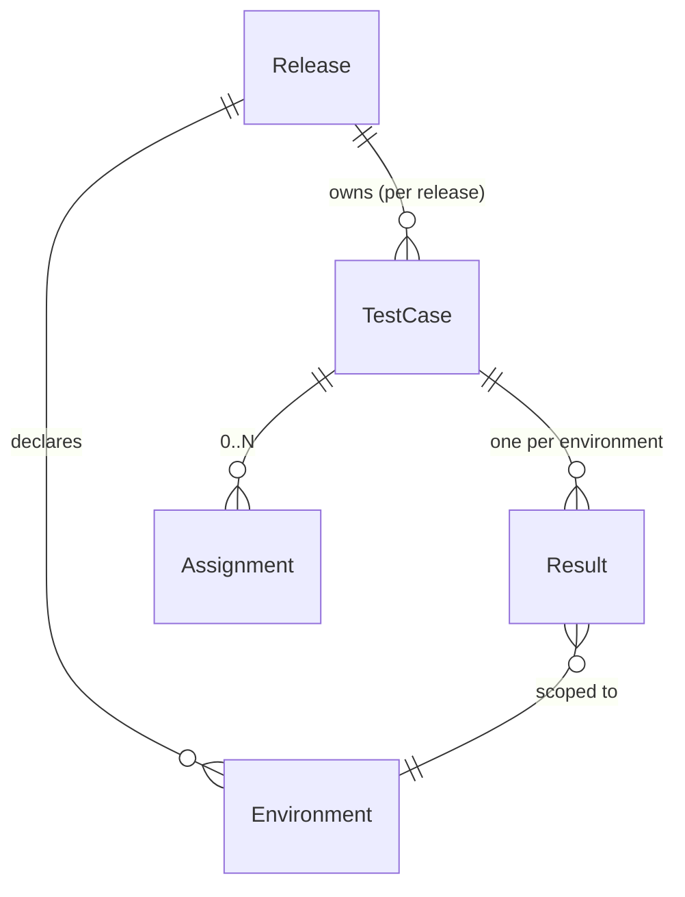

# Testing Domain Model Refactor — Releases × Environments

**Date:** 2026-05-31
**Status:** Authoritative — single source of truth
**Jira:** RXR-11849
**Supersedes:** `2026-05-30-version-history-engine-redesign-design.md` (now deprecated) and the `softwareVersionTested` + embedded `history[]` + `teamSettings.softwareVersion` version machinery.

> This document is the **sole authority** for the Releases × Environments refactor. Where any earlier plan, design doc, or spec disagrees, **this document wins**. Earlier documents are retained only as background and carry no decision authority.

This is a **decision document**, not an implementation plan. It states *what* we are changing and *why*. Concrete schemas, indexes, routes, and test plans are deliberately left to the build phase.

---

## 1. Why we are doing this

Today there is no single answer to the question *"which software version was this test case tested against?"* Three separate fields each claim to hold it, and they drift apart by design:

| Field                             | What it really is                       | Who moves it                     |
| --------------------------------- | --------------------------------------- | -------------------------------- |
| `testCases.softwareVersionTested` | a mutable string on every test-case row | import, restore, bulk edit       |
| `teamSettings.softwareVersion`    | a team-wide display label               | a free-text field, saved on blur |
| `testRuns.softwareVersion`        | a snapshot taken at import time         | never updated after import       |

Because these are independent, normal usage makes them disagree. Editing the team label changes no test-case rows. Re-importing rewrites row values. "Version history" is reconstructed by unwinding an embedded `history[]` array and merging it with live rows in application code, where live data silently overwrites history for any version that appears in both.

The consequences we are trying to escape:

- **No source of truth.** Three drifting strings plus an unbounded "completed versions" list, with nothing keeping them consistent.
- **Free-text versions.** `v2.4.0`, `v2.4.1`, and `2.4.1-hotfix` become three different "versions." There is no canonical list to pick from.
- **No separation of *what was tested* from *where*.** One flat team-wide environment/version setting. A team cannot track QA, Sandbox, and Production results side by side.
- **Operations that do not scale or are unsafe.** Restoring a version loads the entire team's test cases into memory; deleting a "current" version hard-deletes the test-case documents themselves; the embedded history array grows without bound and is rewritten wholesale on every "complete."

The fix is to stop treating "version" as a string scattered across documents, and model the thing it actually represents: a **testing cycle (Release)** whose results are tracked **per environment**.

---

## 2. What we are building

A normalized model with one unambiguous spine:

> **Release → Test Case → Result (per Environment)**

- A **Release** is a named testing cycle (e.g. `v2.9`). It replaces every "version" concept and absorbs the old `test-runs` entity.
- A Release carries its own **test cases** — the requirement text lives with the release that owns it.
- A Release declares its own **environments** (e.g. QA / Sandbox / Production).
- A **result** records the outcome of one test case in one environment of one release.

Everything a QA user does is scoped by a **(Release, Environment)** working context they choose in the UI.

---

## 3. Core concepts

### Release

A named testing cycle, unique per team. It owns its test cases and declares its environments. There is **no lifecycle/status** field — no open/closed/reopen state machine. Any release is editable by an admin at any time, and multiple releases coexist. A release may record which release it was cloned from, for lineage.

### Environment

Environments are named values (uppercased and trimmed on save, so `qa` and `QA` never fork into separate columns) declared **per release**. Defaults are QA, Sandbox, and Production, but a release may have fewer or more. A release always has at least one environment. **A result or environment-scoped assignment can only target an environment the release actually declares** — writes to an unknown or removed environment are rejected.

### Applications and Modules

Applications and modules are **team-global** entities, shared across all releases — every release's test cases reference the same stable application/module records by their internal IDs, not their names, so **renaming one never moves a case's lineage or its import-match scope**. They are **auto-created on import**: when an imported row names an application or module that does not yet exist for the team, it is created on the fly; there is no separate management screen. Each application is assigned a **DB-unique 3-character initial** at creation, derived from its name (e.g. `SAP` for "Super Admin Portal") — this is the namespace prefix for test-case display ids (see import matching), and uniqueness is enforced so two applications can never share an initial (a derivation collision falls back to an alternative until unique). An application or module **cannot be deleted while any test case in any release still references it**; the referencing cases must be reassigned or removed first — no orphans, no cascade wipe.

### Test Case and its stable lineage (`caseId`)

A test case is defined **at the release level**: editing it changes that release's copy and nothing else. All environments within a release share the same set of test cases — there are no per-environment definitions.

Every test case also carries a stable **`caseId`** — a system-generated lineage identifier that stays the same for the *same logical test case across releases*. This is what lets us say "this is the same login test we had in v2.8" without coupling the releases' editable content. The `caseId` is generated when a logical case first appears and reused when it is carried into a later release.

### Result

A result is the outcome of one test case in one environment: **Pass, Fail, or Pending**, plus who tested it, when, and free-text notes. Results are tracked per environment, so the same test case can be Pass in QA and Fail in Production within the same release.

**Decision — results are dense.** Every valid (test case × environment) pair has exactly one result row, defaulting to Pending. Rows are generated when the triggering event happens: release creation, a test case being imported or added, or an environment being added to a release. A new test case immediately gets a Pending row in **every** environment the release declares — never just one — so the "every pair has a row" invariant always holds. *Why dense rather than sparse:* it keeps reads and the status filter trivial (there is always exactly one row to read, count, and filter on — no "missing row means Pending" special case), and it makes per-environment reporting a straight count. The trade-off — storage grows with cases × environments and adding an environment writes a row per case — is acceptable at this product's scale; we deliberately add **no environment cap**, trusting the realistic ceiling (a few thousand cases × a handful of environments) rather than introducing a limit we would have to explain.

### Assignment

Assignments map a test case to a responsible person. An assignment can be **release-wide** or scoped to a **single environment**. When more than one assignment covers the same case-and-environment, the **most recent one wins** as the effective owner; older ones are retained only for history.

The person *assigned* and the person who *actually tested* are intentionally allowed to differ. Assignment answers "who is responsible"; the result's tester answers "who executed it." Reports must show these as distinct facts and never conflate them.

---

## 4. Behaviors

### Creating a release

An admin names the release, chooses its environments, and picks how it starts:

1. **Empty** — no test cases; populate later by import or manual add.
2. **Clone from an existing release** — copies that release's test cases into the new one as **independent rows** that keep the same `caseId` lineage. Cloned cases are not references; editing them never touches the source release. Results start at Pending (they are regenerated for the new release, not copied). **Assignments do not carry forward by default** — the admin must explicitly opt in via a "carry assignments" choice; *why:* a new cycle should not silently inherit possibly-stale ownership.
3. **Excel import** — see below.

### Importing Excel into a release

Import always upserts test cases into the **target release**. A re-import does **not** create version-history records — it simply updates the release. Consistent with the dense rule, importing a case generates its Pending rows across **every** environment the release declares; result columns, when present, additionally populate **one chosen environment**. Every import is summarized for confirmation before anything is committed.

#### How an imported row is matched (the identity rule)

The legacy "Test Case ID" column is **not** a reliable identity: historically it was just a per-application serial number, so inserting a case in the middle renumbers everything below it, and `#1` exists in every application. We therefore never match on it. Identity comes from two keys applied in order — the **Test Key** (round-trip identity) first, the **content fingerprint** (first-touch identity) as fallback:

1. **Test Key is the primary match key (round-trip identity).** Export writes each case's display id (e.g. `SAP-0001`) into a dedicated **Test Key** column. On import, a row whose Test Key resolves to an existing case in the same (team, application, module) **matches that case by its stable `caseId`, independent of content** — so an offline edit to the name, expected result, or notes still lands on the same lineage instead of forking. The Test Key is the system-issued, DB-unique display id (decision 19), not the legacy serial; it is the identifier that survives the export → edit offline → re-import cycle.
2. **No Test Key → content fingerprint is the fallback match key.** For rows with no Test Key — a brand-new case typed into the sheet, or a first-time import from a foreign sheet — compute a hash of the kebab-cased test-case content. Matching is scoped to **(team, application, module)** and looks **across all releases**, not just the target one — the same fingerprint under a different application or module is a different case, so identical names across apps never collide.
3. **Match (by either key) → reuse the `caseId` lineage.** A Test Key match, or a fingerprint match in any release within the same (team, application, module), reuses that case's stable **`caseId`** — this is how a logical case keeps its identity across releases (import establishes lineage, not just clone). Then upsert **release-scoped**: if the target release already holds a row for that `caseId`, update it; if not, create a new row in the target release carrying the inherited `caseId`.
4. **No match by either key → create a new case.** Generate a fresh `caseId`, and build its human-facing display id as the **application's DB-unique 3-char initial + a zero-padded 4-digit serial** (e.g. `SAP-0001`, `SAP-0100`, `SAP-7480`), giving a collision-free per-application namespace rather than a bare serial. This becomes the row's Test Key on the next export.
5. **Ambiguous fingerprint match → newest wins.** If more than one existing case (across releases) in the same (team, application, module) shares the fingerprint, inherit the `caseId` of the **most recently created** one. (Test Key matches are never ambiguous — the display id is DB-unique.)

#### Import safety rules

- **In-file duplicates reject the whole import.** If two rows in the same file resolve to the same case — same Test Key, or same fingerprint within an application/module — the import is **rejected at the confirmation step** with the conflicting rows listed — nothing is committed until the file is fixed. We never silently drop one of two rows.
- **Test Key scope must agree with the row.** A Test Key encodes its application via the 3-char prefix. If a row's Test Key resolves to a case whose application or module differs from the row's own application/module columns, the row is **rejected** — we never silently retarget a case across apps/modules.
- **Unrecognized Test Key falls through, but is surfaced.** A Test Key that resolves to no existing case (e.g. mistyped, or pasted from another team) is treated as *no Test Key* — the row falls through to the fingerprint/new-case path — but the row is **flagged in the import summary** so a fat-fingered id never silently forks a new lineage.
- **The summary distinguishes create from update.** Every matched row is shown as `update SAP-0001 (was: "<prior name>")`, every unmatched row as a create, so an unintended overwrite — e.g. a duplicated row that kept its Test Key — is visible **before** commit.
- **All-or-nothing validation.** The entire file is validated first (required columns present, every row well-formed). Any structural error or invalid row **rejects the whole import** with a per-row error report; the release is never left partially populated.

### Editing a test case

An edit applies to **all environments in that release**, because the environments share one definition. The editor must make this explicit so it is never mistaken for an environment-scoped change. Because the requirement text every existing result was recorded against is changing, the editor offers an **opt-in "reset all environments to Pending"** choice (default off): off leaves results untouched; on resets them with a recorded reason. Edits never propagate to other releases.

### Recording or resetting a result

A result write targets exactly one (test case, environment) in the active release. Marking **Fail requires notes**; **resetting to Pending requires a reason** and clears the tester/date while keeping the row. The target environment must belong to the release. The tester is recorded as the current user. **Concurrent writes to the same cell are last-write-wins** — there is no version token.

### Assigning

Creating an assignment chooses release-wide or a specific environment (validated against the release). Assigning does not delete prior overlapping assignments; the most recent wins as the effective owner.

### Deleting (cascades at every level)

- Delete a **release** → removes its test cases, results, and assignments.
- Delete a **test case** → removes its results across all environments and its assignments.
- Remove an **environment** from a release → removes that environment's results and its environment-scoped assignments; release-wide assignments are untouched.

### Archiving a release

Releases accumulate, so each release carries a single **`archived`** boolean that an **admin** toggles manually — there is no auto-archive and no broader lifecycle state machine (this is the one deliberate amendment to the "no status field" stance; see decision 4). Archiving is fully reversible. While a release is archived it is **frozen and de-emphasized**:

- **Hidden** from the default release selector (still reachable via search/typeahead, §below).
- **Read-only** — no new results, definition edits, assignments, or imports until it is un-archived. *Why:* it signals "this cycle is done" and prevents stray writes to a closed-out release.
- **Excluded from default reporting and analytics** aggregates (dashboards, cross-release comparison), though it can still be opened and exported directly. *Why:* finished cycles shouldn't dilute current metrics.

### Working context (Release + Environment)

The active (Release, Environment) selection lives **only in client/session state**, never on the user record. *Why:* two browser tabs can hold different selections without clobbering each other, and every mutation sends its intended release and environment explicitly, so a write always lands where the user is actually looking. On load, a stored selection is validated against what still exists and falls back to the **most recent non-archived** release and its first environment if it is dangling, archived, or unset.

The release selector is a **flat, newest-first list with a search/typeahead**, so it scales to any number of releases with a single control. By default it lists only **non-archived** releases; archived ones are excluded from the list but remain findable through search.

---

## 5. Business rules we are keeping (and the one we are dropping)

| Rule                                                                  | Decision                              |
| --------------------------------------------------------------------- | ------------------------------------- |
| Cannot blank the test name or expected result                         | **Keep**                              |
| Expected result must exist before a case can be marked Pass/Fail      | **Keep**                              |
| Notes required when marking Fail                                      | **Keep**                              |
| Reason required when resetting to Pending                             | **Keep**                              |
| Environment must belong to the release on any result/assignment write | **New**                               |
| Tester is recorded as the current user, regardless of who is assigned | **Keep**                              |
| Notes are settable only through a status action, not edited freely    | **Keep**                              |
| `softwareVersionTested` required to mark Pass/Fail                    | **Drop** — the field no longer exists |

---

## 6. What gets removed

- **`teamSettings` collection — deleted entirely.** Its version, environment, and "completed versions" fields are subsumed by releases and environments. No replacement collection is introduced.
- **The `test-runs` entity — replaced by releases.** Imports upsert into a release instead of creating an import-record row.
- **`softwareVersionTested`** on test cases, and every read/write/filter/index that depends on it.
- **The embedded `history[]` array** and the entire group / retag / restore-into-live / complete-version machinery.
- **The team-wide free-text Environment and Software Version inputs** on the Reports and import screens (now release attributes), along with the retag/restore/complete controls.

---

## 7. Decisions on record

| #   | Decision                                                                 | Rationale                                                                                            |
| --- | ------------------------------------------------------------------------ | ---------------------------------------------------------------------------------------------------- |
| 1   | **Dense results** — one row per (case × environment), default Pending    | Trivial reads and counts; no "missing row" special case; cost acceptable at scale                    |
| 3   | **Clean slate** — no migration of existing data (**confirmed**: backup taken, drop approved) | Existing test data is dropped per project policy; no backward compatibility. Owner has a one-time backup; no live data needs export before launch |
| 4   | **No release lifecycle state machine** — but a single manual `archived` boolean exists (see decisions 15–16) | KISS; admins edit any *active* release at any time; the one allowed status is a reversible archive flag, not a multi-state workflow |
| 5   | **Working context is client/session only**                               | No multi-tab clobber; every write carries its scope explicitly                                       |
| 6   | **Last-write-wins on results; latest-wins on assignments**               | No optimistic-concurrency token; concurrent cell writes resolve last-write-wins                      |
| 7   | **Import identity is a two-key ladder: the Test Key first, the content fingerprint as fallback.** The **Test Key** (the case's system-issued, DB-unique display id, exported in a dedicated column) matches an existing `caseId` **independent of content**, so the export → edit offline → re-import cycle round-trips without forking. Rows with no Test Key fall back to a **content fingerprint** scoped to (team, application, module), matched **across releases** to inherit the `caseId`. The legacy serial is never used to match. | Content-as-identity solves first import but self-defeats on re-import: editing content (the point of offline edit) changes the key and forks. The Test Key is stable across edits and DB-unique; the fingerprint still onboards genuinely new rows. Ambiguous fingerprint → newest case wins; Test Key is never ambiguous |
| 13  | **In-file duplicate rows reject the whole import**                       | Never silently drop one of two conflicting rows; force the user to fix the file                      |
| 14  | **Import validation is all-or-nothing**                                  | A bad/partly-bad file never leaves the release partially populated; per-row errors reported up front |
| 15  | **Manual `archived` flag, admin-only, no auto-archive**                  | Keeps old releases out of the way without an implicit hiding rule that could bury a still-wanted release |
| 16  | **Archived = hidden + read-only + excluded from default reporting/analytics**, fully reversible | Signals a closed-out cycle, blocks stray writes, and stops finished cycles diluting current metrics |
| 17  | **Release selector is a flat newest-first list + search**; default lists non-archived only | Scales to any release count with one control; archived releases stay findable via search |
| 8   | **Scale via `{ teamId, releaseId }`-prefixed indexes; no sharding/partitioning** | MongoDB has no SQL-style partitioning; release-scoped indexes isolate queries cheaply — revisit sharding only if metrics prove a node is the bottleneck |
| 9   | **No environment cap** on a release                                      | Realistic ceiling (a few thousand cases × a handful of envs) is comfortable; avoid a limit we'd have to explain |
| 11  | **Clone does not carry assignments by default** (explicit opt-in)        | A new cycle shouldn't silently inherit stale ownership                                               |
| 12  | **Import generates Pending rows for all environments**, not just the targeted one | Preserves the dense "every pair has a row" invariant                                                 |
| 18  | **Applications/modules are team-global**, referenced by stable ID (rename-safe), **auto-created on import**, no management screen | Keeps cross-release lineage and import-match scope coherent; lowest-friction setup |
| 19  | **Each application gets a DB-unique 3-char initial** at creation, derived from its name, used as the display-id prefix | Collision-free per-application namespace (`SAP-0001`, `SAP-0100`, `SAP-7480`); resolves the earlier app-initials ambiguity |
| 20  | **App/module delete is blocked while referenced** by any case in any release | No orphans and no cascade wipe; admin must reassign/remove the cases first |

---

## 8. Out of scope (for now)

- Reporting redesign beyond per-(release, environment) scoping and release-vs-release comparison — detailed report layouts are a follow-up.
- A per-environment "not applicable" marker — every case stays Pending in every environment until tested (reviewed and deferred).
- Auth and role changes — the existing model is unchanged.
- Exact storage shapes, indexes, API/transport choices, and the full test plan — these belong to the implementation phase. Some build-phase choices have nonetheless been pinned in §10.

---

## 9. Resolved questions

All previously-open questions have been decided and folded into §3, §4, and the decisions table (§7):

1. **Dense-result cost ceiling** → **no environment cap** (decision 9). Trust the realistic scale rather than impose a limit.
2. **Clone defaults** → **assignments off by default**, explicit opt-in (decision 11).
3. **Import + dense results** → **all environments get Pending rows immediately** (decision 12), preserving the every-pair-has-a-row invariant.

No open questions remain. Changes to these decisions are amendments to this document.

---

## 10. Build-phase guidance (decided)

These are *how-to-build* decisions — not domain-model rules, but settled so the implementation doesn't re-litigate them.

| Area | Decision | Why / trade-off |
| --- | --- | --- |
| **Listing query shape** | The (release, environment) listing is **driven from `testResults`**, scoped by `releaseId + environment`, with the test case looked up for content/app/module. Pagination and the status filter operate on the result rows. | Dense results mean exactly one row per case per env, so status is index-direct and pagination matches what's displayed — no filter-after-join. |
| **Bulk-write / rate limiting** | **Keep the existing in-memory, per-process rate limiter as-is.** No batch-size cap and no shared/distributed limiter added for this feature. | Accepts the known per-process limitation; revisit only if the deployment goes genuinely multi-replica and abuse becomes real. |
| **Cross-team isolation** | **Central scoping + a dedicated isolation test suite.** All reads/writes inject `teamId` through the data layer, and a two-team test suite asserts team A can never read or write team B's releases, cases, results, and assignments. | Structural prevention *and* proof — belt and suspenders against the highest-impact data-leak class. |
| **`testedOn` timezone** | **Store in UTC; present and enter in the viewer's local timezone.** The "cannot be in the future" check is evaluated in the user's local zone at entry, then persisted as UTC. | Unambiguous storage with intuitive local-time UX; display converts per viewer. |
| **Backups / observability** | **Defer to existing infrastructure.** No new backups, metrics, or error-tracking work is required for this feature beyond what the platform already provides. | Lowest effort for launch; accepts reduced insight if a production issue arises. Can be raised later if operational pain appears. |
