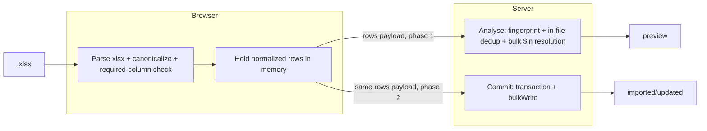

# Import Excel — Client-Offload Performance Redesign

- **Date:** 2026-06-01
- **Status:** Draft for review
- **Scope:** Reduce server load of the two-phase Excel import by parsing in the
  browser, sending a compact rows payload, parsing once instead of twice, and
  bulkifying the analyse phase. Delivered as independently-shippable phases.
- **Out of core scope:** result-row write amplification (tracked as a future
  Phase 5 below).

---

## Problem

The two-phase import route (`POST /api/releases/[id]/import`, analyse →
confirm) is expensive on every server resource. Measured against the current
code:

| # | Cost | Where | Why it hurts |
|---|------|-------|--------------|
| 1 | Same file uploaded + SheetJS-parsed **twice** | `ImportCasesClient.jsx:99-101` then `:115-120`; re-parsed in `analyseImport` (`importExcelData.js:362`) **and** `commitImport` (`:560`) | 2× network transfer + 2× full parse for one logical import |
| 2 | Analyse = **O(N) sequential DB round-trips** | `analyseImport` awaits `resolveRowIdentity` per row (`:414`); each does up to 3 serial finds (`:158-194`) | A 2,000-row file ≈ up to ~6,000 serial queries. `commitImport` already uses `$in` bulk reads (`:614-674`); analyse never got the same treatment |
| 3 | **SheetJS on the Node runtime** | `XLSX.read` (`utils/excelImport.js:45`) | Synchronous → blocks the event loop for the whole parse; holds the entire workbook in heap (a 50 MB xlsx → 300–400 MB heap per SheetJS docs). Stalls other requests on the instance |
| 4 | Whole file **buffered in memory** | `Buffer.from(await file.arrayBuffer())` (`route.js:87`) | App Router route handlers cannot cap body size — large upload = memory spike + 413 risk |
| 5 | Dense-result **write amplification** | `generateDenseResults` writes one doc per (new case × environment) (`testResultsData.js:92-106`) | 1,000 new cases × 4 envs = 4,000 inserts on top of 1,000 case inserts. *(Phase 5 / future.)* |

**Confirmed constraints (from validation against current code):**

- Scale is medium: typical imports are 500–5,000 rows. A single request per
  phase is sufficient; streaming/chunked commit is **not** justified.
- All four resources (CPU, memory, DB, latency) are pain points, so the
  redesign must attack the parse, the payload, and the query count together.

## Goals / Non-goals

**Goals**

- Stop running SheetJS on the server.
- Transmit and parse the workbook exactly once per logical import.
- Make analyse cost independent of row count (bulk reads).
- Shrink the wire payload well below the raw `.xlsx`.
- Keep every data-integrity decision server-authoritative.

**Non-goals**

- Backward compatibility / dual-format shims (clean-slate per project rules).
- Changing the import *semantics* (which rows create vs update) — except the one
  intentional correctness fix in Phase 2 (see Trust Boundary).
- Result-row write amplification (Phase 5, future track).

## Target architecture

The `.xlsx` never reaches the server. The browser parses once; both phases send
the already-normalized rows.

## Trust boundary & validation contract

The route's existing rule holds: *"the FE already guards these, but the BE must
not trust the client."*

- **Client offloads only the expensive + structural work:** SheetJS parse,
  column canonicalization (`canonicalColumn`), required-column detection,
  text normalization, and MIME/extension check. Column/file errors surface in
  the browser **before any upload** (instant feedback, zero round-trip).
- **Server keeps all integrity-critical work:** fingerprint derivation
  (`slugify(testCase)`), in-file duplicate detection, identity resolution, and
  all writes. The status whitelist (`COMPLETED_STATUSES`), required-field
  re-check, `appInitialOverrides` regex, and **new size caps** (starting values:
  ≤ 10,000 rows — 2× the expected 5k ceiling — and ≤ 20,000 chars per field,
  both tunable) are re-applied server-side. The client never sends a fingerprint
  or any resolved identity.

Rationale: the only heavy cost is the SheetJS parse (CPU + heap). Fingerprinting
and dedup over 5k rows are microseconds server-side, so keeping them on the
server shrinks the client code and the trust surface, and leaves `slugify`
server-only.

### Wire row shape (13 fields — preserved exactly from `parseWorkbookBuffer`)

`applicationName`, `moduleName`, `type`, `traceability`, `testKey`, `testCase`,
`preconditions`, `steps`, `expectedResult`, `notes`, `status`, `testedBy`,
`testedOn`. (`softwareVersionTested` is intentionally **not** emitted, matching
current parser behavior, even though `canonicalColumn` maps it.)

## Phased plan

Every phase leaves import fully functional end-to-end and contains no
back-compat shims.

| Phase | Goal | Costs fixed | Ships alone? | Depends on |
|-------|------|-------------|:---:|:---:|
| 1 — Bulkify Analyse | `$in` batch resolution + characterization tests | #2 | ✅ | — |
| 2 — Client Parse + JSON Contract | Browser parses once; server stops running SheetJS | #1, #3, #4 | ✅ | reuses P1 logic |
| 3 — Compact Wire Format | Positional rows + header (optional gzip) | latency, residual #4 | ✅ | P2 |
| 4 — Web Worker *(optional)* | Parse off the main thread | client UX | ✅ | P2 |
| 5 — Lazy Dense Results *(future)* | Stop materializing case×env Pending rows | #5 | ✅ | — |

### Phase 1 — Bulkify Analyse

- **Step 1 (test-first, approved):** add characterization tests for
  `analyseImport` pinning current behavior, mirroring
  `lib/__tests__/db/importExcelData.test.js`. The semantics to lock:
  1. testKey found, same team, app+module names match → `update`.
  2. testKey found, different team → `reject` ("belongs to a different team").
  3. testKey found, app/module name mismatch → `reject` ("belongs to a
     different application or module").
  4. testKey provided but not in DB → fingerprint fallback **+ warning**
     ("Test Key X was not found — treated as new (fingerprint fallback)").
  5. no testKey, fingerprint matches (team-wide, newest-wins) → `update`.
  6. no testKey, no fingerprint match → `create`.
  7. in-file duplicate (same testKey, or same `appName::modName::fingerprint`)
     → both rows `reject`.
  8. preview mapping: reject rows excluded from `rows[]` but surfaced in
     `errors[]`; `valid = errors.length === 0`; `createCount`/`updateCount`;
     `proposedInitials` for new apps; `warnings[]`.
- **Step 2 (refactor):** replace the per-row `resolveRowIdentity` loop with the
  same `$in` batch reads + in-memory resolution `commitImport` already uses
  (`importExcelData.js:614-674`), preserving every semantic above. Route,
  client, and wire format unchanged — still uploads `.xlsx`, still parses
  server-side.
- **Files:** `lib/db/importExcelData.js` (analyse only); new
  `lib/__tests__/db/analyseImport` characterization tests.
- **Independently functional / done-when:** import behaves identically; analyse
  issues a bounded ~5 queries regardless of row count; all characterization
  tests green.
- **Carry-forward:** the bulk-resolution code is reused verbatim by Phase 2.

### Phase 2 — Client Parse + JSON Contract *(the offload)*

- **Scope:**
  - Move the parse stack to a client module: `parseWorkbookBuffer`,
    `canonicalColumn`, `normalizeText`, `mergeImportNotes`, required-column
    detection. Use the established `await import('xlsx')` dynamic-import pattern
    (precedent: `app/(app)/reports/ReportsClient.jsx:192`) so SheetJS stays
    code-split.
  - `ImportCasesClient.jsx`: parse once on file selection, hold normalized rows,
    send them as JSON for both analyse and commit (instead of the file).
  - Route: accept `application/json` with a `rows` array (not multipart). Drop
    MIME / `arrayBuffer` / `Buffer` handling. Wire a real zod request schema
    (see cleanup F3) — `releaseId` continues to come from the path param.
  - `analyseImport` and `commitImport`: take `rows` instead of `buffer`; remove
    the `parseWorkbookBuffer` calls and the server `xlsx` import.
  - **Shared resolver:** extract one identity-resolution function used by both
    analyse and commit. This eliminates the latent divergence found in
    validation — analyse currently resolves fingerprints **team-wide**
    (`:241`), commit resolves them **app+module-scoped** (`:644`), so the
    preview can disagree with the commit. The unified resolver adopts commit's
    app+module-scoped behavior (authoritative, since commit writes). **This is an
    intentional behavior change:** the preview becomes more accurate. The Phase 1
    characterization test for case (5) is updated here to reflect it.
- **Trust/validation (server):** zod-validate the payload; re-derive
  fingerprint; re-apply status whitelist + required-field check + override
  regex; enforce row-count/field-length caps; existing release/env/team checks.
- **Unhappy paths:** column/file errors → surfaced in-browser pre-upload;
  payload fails schema → 400; row count over cap → 400; invalid override → 400;
  release missing/archived/env mismatch → 404/409/400 (unchanged).
- **Note:** `xlsx` stays in `package.json` (Reports needs it). "Remove server
  xlsx" means removing it from the server execution path only.
- **Independently functional / done-when:** import works end-to-end; server
  never runs SheetJS; `.xlsx` never transmitted; single parse in the browser.
- **Files:** `ImportCasesClient.jsx`, `app/api/releases/[id]/import/route.js`,
  `lib/db/importExcelData.js`, `utils/excelImport.js` (split client parse vs
  server validate), `lib/schemas/import.js` (+ request schema),
  `lib/api/releases.js`; tests updated (commit tests pass `rows` in opts instead
  of mocking the parser; route + client tests updated for the JSON contract).

### Phase 3 — Compact Wire Format

- **Scope:** encode rows positionally (array-of-arrays + a fixed header order)
  instead of per-row objects; optional gzip via `CompressionStream` /
  `DecompressionStream`. Isolated to the encode (client) / decode (route) seam.
- **Unhappy paths:** malformed positional payload → 400.
- **Independently functional / done-when:** import works; payload measurably
  smaller than Phase 2; round-trip encode/decode tests green.
- **Open decision lives here:** positional+header (recommended) vs straight-to-
  gzip vs both — decided at the start of this phase.

### Phase 4 — Web Worker *(optional)*

- **Scope:** run Phase 2's parse in a worker (`new Worker(new URL(...))` +
  Turbopack worker support); propagate parse errors back as UI errors. This is
  the **only** phase needing new bundler config — Phase 2's main-thread parse is
  already proven by the `ReportsClient` precedent.
- **Unhappy paths:** worker load/parse failure → clear UI error (and/or
  main-thread fallback).
- **Independently functional / done-when:** import works; parsing a 5k-row file
  keeps the UI responsive.

### Phase 5 — Lazy Dense Results *(future track, out of core)*

- **Scope:** stop materializing one Pending `testResults` doc per (new case ×
  environment); materialize on first view/edit, or treat absence as Pending.
- **Why deferred:** changes the *read* model across dashboard, reports, and
  test-cases — a separate workstream with wide blast radius. Listed so it is not
  silently dropped; scoped and planned on its own.

## Cross-cutting

### Cleanup (clean-as-you-go, from validation)

- **Delete `lib/schemas/importExcel.js`** — orphaned `importExcelResponseSchema`
  (predates the releases refactor, lacks `releaseId`, zero importers).
- **Retire the unused `importBodySchema`** by replacing it with the real request
  schema wired into the route in Phase 2 (today the route hand-rolls FormData
  validation).

### Error handling

Server validation order: payload schema → row/field caps → per-row
required-field re-check (drops to skip, matching current) → status whitelist →
override regex → release active/env-declared. All errors keep the existing
`{ error }` response shape. Edge to harden (optional): `deriveInitial` throws on
an app name with no alphanumerics — currently 500s analyse; consider returning a
row-level error instead.

### Security

No file upload removes the file-type-spoofing surface but adds an arbitrary-JSON
surface; mitigated by zod + row-count/field-length caps + full server-side
re-validation and team scoping. AuthZ unchanged (`withAdmin` gates the route).

## Testing strategy

- **Phase 1:** new `analyseImport` characterization tests (approved) lock the 8
  semantics; refactor keeps them green. Parser tests
  (`utils/__tests__/excelImport.test.js`) remain valid — pure function, now
  executed client-side.
- **Phase 2:** `commitImport` tests switch from mocking `parseWorkbookBuffer` to
  passing `rows` in opts; route test updated for the JSON contract; client test
  updated for parse-and-send; the case-(5) characterization test updated for the
  intentional app+module-scoped fix.
- **Phase 3:** encode/decode round-trip + malformed-payload tests.
- **Phase 4:** parse error propagation (the parse fn itself is already covered;
  worker wiring verified manually — framework wiring is out of unit-test scope
  per project rules).
- Per project rule, new test additions in Phases 2–4 are confirmed at
  implementation time. Phase 1's characterization tests are pre-approved.

## Risks & mitigations

| Risk | Mitigation |
|------|------------|
| Phase 1 silently changes untested resolution behavior | Characterization tests first (approved) |
| Phase 2 malicious/oversized client payload | zod schema + row-count/field-length caps + full server re-validation |
| Preview disagrees with commit (fingerprint scope) | Unified resolver in Phase 2 (also fixes the latent bug) |
| Phase 4 worker bundling under Turbopack | Isolated to its own phase; main-thread parse (proven via Reports) is the fallback |
| Client bundle size from SheetJS | Already paid — `xlsx` is an existing client dep (Reports) |
| `/import-cases` render crash in smoke test | Appears stale: `app/(app)/layout.js:27` already wraps `ReleaseEnvProvider`; reconcile before Phase 2 manual testing |

## Open decisions

1. Wire format (Phase 3): positional+header vs gzip vs both — decide at Phase 3.
2. Optional hardening: guard `deriveInitial` degenerate-name edge; re-validate
   `testedBy` against team QA users (currently lenient).

## Validation notes (against current code, 2026-06-01)

- `xlsx` already client-side via `ReportsClient.jsx:192` (`await import('xlsx')`).
- Only `analyseImport` + `commitImport` call `parseWorkbookBuffer`; blast radius
  contained.
- `lib/schemas/importExcel.js` orphaned; `importBodySchema` unused.
- Parser well-tested; analyse resolution untested → Phase 1 tests first.
- `ReleaseEnvProvider` is wired in `app/(app)/layout.js:27`; smoke-test crash
  predates the working tree.
