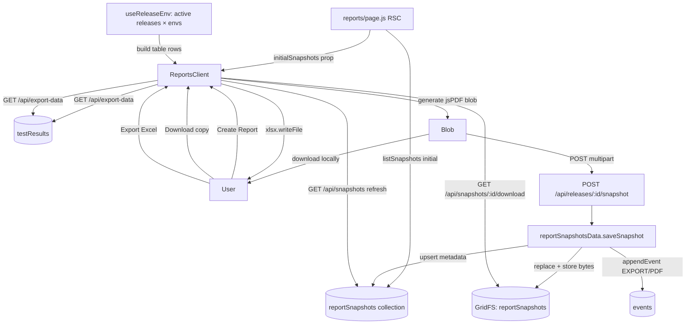

# Reports Page — Regression Reports (PDF Snapshots) & Excel Export

**Date:** 2026-06-01
**Jira:** RXR-11849
**Status:** Draft for review

## 1. Problem & Goals

The current `/reports` page (rebuilt on the releases+environments model) shows an
Overview + Application Breakdown + ad-hoc Excel/PDF export, but it lost the
report-history concept and never persisted anything. The product intent is
narrower and clearer:

- **Regression report (PDF) = a stored, point-in-time snapshot** of results for a Release +
  Environment. Creating one generates a fresh PDF, downloads it, and saves it as the latest copy
  for that combination.
- **Saved copy = the exact PDF last generated** for a combination — re-downloadable without
  rebuilding it.
- **Excel = an editable, import-compatible spreadsheet** of the latest data — never stored.

All three are surfaced in **one unified table**: every active Release + Environment is a row
showing its latest report, with row actions to **create a new report**, **download the saved copy**,
or **export Excel**.

The UI must be **intuitive and self-guiding** for a first-time user: every action
explains what it does and what it will (and won't) change, via MUI `<Alert>`,
`<Tooltip>`, and `helperText` — no external documentation required.

### Non-goals (YAGNI)

- No chronological archive of past snapshots (only the latest per combo is kept).
- No snapshot deletion UI in this iteration (replacement is the only mutation).
- No server-side PDF rendering — PDFs are generated client-side and uploaded.
- No Excel snapshotting, auditing, or history.
- No backward-compatibility shims for the removed `versions`/`testRuns` model.

## 2. Behavior Specification (source of truth)

### Regression report (PDF)

- Each Release + Environment row offers **Create Report**, which **generates a fresh PDF** and
  **immediately downloads it** to the user.
- The same generated bytes are **saved as the latest copy** (snapshot) for that Release + Environment.
- **Exactly one copy is retained per (Release, Environment).** Creating a new report **replaces** the
  prior copy (old GridFS bytes are deleted).
- The saved copy can be **re-downloaded later without regeneration** — the exact original bytes are returned.
- Creating a report writes an **audit event** (`category: EXPORT`, `action: PDF`).

### Unified report table

- One row per **active Release + Environment**, plus a download-only row for any saved copy whose
  release is no longer active (so no report is hidden from the UI).
- Each row shows the **latest saved copy** for that combo — its timestamp and who generated it —
  or **"Not generated yet."**
- It is **not** a chronological archive — only the latest copy per combo is kept.
- Columns: **Release · Environment · Latest Report · Actions** (Create Report · Download copy · Export Excel).

### Excel

- Each row offers **Export Excel** for its Release + Environment.
- Always built from the **latest saved data** for that combination.
- Output is **import-compatible** with the associated Release (round-trips through `utils/excelImport.js`).
- Export **does not** create a report, saved copy, or audit entry.

## 2.1 Implementation Principles (clean-slate)

This is a clean-slate rebuild, not an incremental patch on the existing page. The implementation
plan and the resulting code must follow these:

- **Rewrite, don't diff.** `ReportsClient.jsx` is authored fresh from the design below — not the
  current file with lines added/removed. The result should read as if written from scratch, with a
  coherent top-to-bottom structure (header → guidance → unified report table), not as accreted patches.
- **No legacy, no back-compat.** Nothing is preserved "just in case." Anything the new design
  doesn't use is deleted in the same change (see §3.1) — dead imports, props, state, helpers, files.
- **Idiomatic over clever.** Follow the patterns already established in the codebase: `(db, teamId, …)`
  DB-layer signatures returning `toClientDoc`, `withTeam`/`withAdmin` route wrappers, `lib/api/*`
  client helpers that mirror route shapes, MUI v9 components from `@/components`, enums from
  `@/lib/constants`. Match the surrounding code's naming, comment density, and idiom.
- **Single purpose per unit.** Each new file does one thing: `reportSnapshotsData.js` owns storage,
  each route owns one HTTP concern, `lib/api/snapshots.js` owns client transport, `ReportsClient`
  owns presentation + flow orchestration only. No DB queries in routes/pages, no transport in components.
- **No silent failure paths.** Every branch is handled and observable (toast / Alert / HTTP error);
  no happy-path-only logic (see §6).

## 3. Architecture



### Data model

**GridFS bucket:** `reportSnapshots` (`reportSnapshots.files` / `reportSnapshots.chunks`).
Stores the raw PDF bytes. The GridFS file `metadata` carries `{ teamId, releaseId, environment }`
so orphan cleanup and team scoping are enforceable.

**Metadata collection:** `reportSnapshots`

| Field | Type | Notes |
|---|---|---|
| `_id` | ObjectId | |
| `teamId` | string | mandatory scope on every query |
| `releaseId` | string | |
| `releaseName` | string | denormalized for display (release may later be renamed; snapshot keeps the name at generation time) |
| `environment` | string | |
| `fileId` | ObjectId | GridFS file id |
| `filename` | string | e.g. `regression-signoff-2.5-QA-2026-06-01.pdf` |
| `byteSize` | number | |
| `generatedBy` | string | `session.user.name` (fallback email) |
| `generatedAt` | Date | |

**Unique index:** `{ teamId: 1, releaseId: 1, environment: 1 }` — enforces one snapshot per combo.
Replacement = delete old GridFS file by `fileId`, then upsert metadata + new `fileId`.

### New / changed files

| File | Change |
|---|---|
| `lib/db/reportSnapshotsData.js` | **new** — `saveSnapshot`, `listSnapshots`, `getSnapshotFile` |
| `app/api/releases/[id]/snapshot/route.js` | **new** — `POST` multipart (PDF blob + environment) |
| `app/api/snapshots/route.js` | **new** — `GET` list snapshots for team (unified-table refresh after Create) |
| `app/api/snapshots/[id]/download/route.js` | **new** — `GET` stream PDF from GridFS |
| `lib/api/snapshots.js` | **new** — client helpers: `saveSnapshot(releaseId, formData)`, `listSnapshots()`, `snapshotDownloadUrl(id)` |
| `app/(app)/reports/page.js` | rewritten: fetch + pass `initialSnapshots` from `listSnapshots(db, teamId)`; no `listApplications` |
| `app/(app)/reports/ReportsClient.jsx` | **rewritten from scratch** to the §5 structure (header → guidance → unified report table); not a diff of the current file (see §2.1, §3.1) |
| `app/(app)/reports/loading.js` | rewritten skeleton matching the new layout exactly (per `loading.js` parity rule) |
| `lib/constants.js` | reuse `AUDIT_CATEGORY.EXPORT` / `AUDIT_ACTION.PDF` (already present — no change) |

### 3.1 Clean-slate removals (no legacy, clean as you go)

This is a clean-slate rebuild — delete every construct made redundant by the new design in the
same change; leave no dead imports, props, state, or files behind.

| Remove | Reason |
|---|---|
| Overview panel + `summary` state, `computeSummary`, `MetricCard` (`ReportsClient`) | Overview eliminated — the page surfaces only the three actions; no read-only metrics view. |
| `appBreakdown` state + Application Breakdown table (`ReportsClient`) | Out of scope for the spec's three actions; "keep it simple and focused." |
| `listResults` + `<PassRateBar>` imports (`ReportsClient`) | Their only consumer was the removed Overview/breakdown; exports read from `apiExportData`. |
| `AssessmentOutlinedIcon` import (`ReportsClient`) | Only referenced by the removed Overview/breakdown empty states. |
| Client-side `caseId → applicationId` join (`listTestCasesForRelease` + `caseAppMap`/`appGroups`/`appNameMap`) | The join silently dropped rows and was never a reliable signal (flagged risk). Removed entirely. |
| `applications` prop + `listApplications` import (`page.js`, `ReportsClient`) | Only fed the breakdown name map and the scope select — both removed. |
| "Application / Scope" select in the Export panel | Spec scopes exports to Release + Environment only; no per-application filtering. |
| Single active-selection scoping + Context-bar chips (`ReportsClient`) | The page no longer scopes to the top-nav's active Release + Environment; it lists every combo in one table. `useReleaseEnv` is kept *only* as the source of the releases × environments list. |
| `selectedApp` / `generatingExcel` / `generatingPdf` single-flight state (`ReportsClient`) | Replaced by per-row keyed busy state (one row can be creating while others stay idle). |
| `lib/db/reportsData.js` (if any stale copy resurfaces) | Already deleted on `dev`; ensure no re-import. |
| Unused icon imports left after the rework | Clean-as-you-go: prune on touch. |

After removal, `ReportsClient` keeps only: `useReleaseEnv` (source of active releases × environments),
the `initialSnapshots` prop, a pure `buildReportRows(releases, snapshots)` row-builder, `apiExportData`
(Excel/PDF data), `generateSignoffReport`, the new `lib/api/snapshots.js` helpers, and the shared UI
components. No test-result data is fetched for display — the page renders the unified report table only.

### `lib/db/reportSnapshotsData.js` interface

```js
// Store/replace the single snapshot for (release, env). Returns client metadata doc.
saveSnapshot(db, teamId, { releaseId, releaseName, environment, generatedBy, buffer, filename })

// All snapshots for the team, newest first. Returns client metadata docs.
listSnapshots(db, teamId)

// Resolve a snapshot for download. Returns { stream, filename, byteSize, contentType }.
getSnapshotFile(db, teamId, snapshotId)
```

All functions take `(db, teamId, …)`, validate `teamId`, scope every query by `teamId`,
and return metadata via `toClientDoc`. `saveSnapshot` runs inside a transaction:

1. find existing metadata for `(teamId, releaseId, environment)`;
2. if present, delete its GridFS file;
3. open GridFS upload stream, write `buffer`, capture new `fileId`;
4. upsert metadata;
5. `appendEvent(db, teamId, { category: EXPORT, action: PDF, releaseId, environment, by: generatedBy, at })`.

> Note: GridFS streams are not transactional with the metadata write. The transaction
> wraps the metadata upsert + event; the GridFS write happens first and is referenced by
> `fileId`. If the metadata upsert fails, the freshly written GridFS file is deleted in a
> `catch` to avoid orphans.

## 4. Client flow (ReportsClient)

### Table rows

A module-level pure `buildReportRows(releases, snapshots)` (exported for unit test) derives the table:

1. For each **non-archived** release in `useReleaseEnv().releases`, emit one row per `environment`,
   left-joining the saved copy keyed by `releaseId::environment` (`null` if none → "Not generated yet").
2. Append a **download-only** row for any saved copy whose `(releaseId, environment)` is not already
   covered above (release archived/renamed) so no stored report is hidden.
3. Sort by release name, then environment.

Rows hold `{ releaseId, releaseName, environment, snapshot, generatable }`. `initialSnapshots` (server
prop) seeds the list; after a successful Create, the client refreshes via `listSnapshots()`.

### `onCreateReport(row)` — per row, busy state keyed by `releaseId::environment`

1. `const cases = await apiExportData({ releaseId, environment })`.
2. If `cases.length === 0` → `showToast('No test cases to report on for this release and environment', 'info')`, abort.
3. `const doc = await generateSignoffReport({ cases, appName: 'All Applications', environment, version: releaseName })`.
4. `const blob = doc.output('blob')`.
5. **Immediately download** locally: `doc.save(filename)` (or anchor click on the blob).
6. **Upload** the same `blob` via `FormData` → `POST /api/releases/:id/snapshot` (`environment`, `filename`, `file`).
7. On success: `showToast('Regression report created and downloaded', 'success')`; refresh the table
   (`listSnapshots()` or optimistic upsert of the new copy into that row).
8. On upload failure: the local download already happened — `showToast('Report downloaded, but saving the copy failed — try again', 'warning')`.

### `onDownloadCopy(row)`

Anchor navigation to `snapshotDownloadUrl(row.snapshot.id)` — streams the **exact saved bytes**, no
regeneration. Only rendered when `row.snapshot` exists.

### `onExportExcel(row)` — per row, busy state keyed like Create

Builds from `apiExportData({ releaseId, environment })` and writes the workbook client-side (`xlsx`).
Empty selection → the same info toast as Create. Creates **no** saved copy, audit event, or table change.

## 5. UI / UX Design (self-guiding)

**Aesthetic direction:** refined, calm, utilitarian — this is an internal QA tool, so clarity
beats flourish. Restraint executed precisely (per frontend-design): generous spacing, a single teal
accent reserved for the primary action, no decorative noise. The page must read as a finished,
production-grade surface — never a half-built dev scaffold. Every control states plainly what it does
and what it changes, in plain, friendly language; distinctiveness comes from that *guidance*, not ornament.

The whole page is **one table**. There is no per-action panel and no top-of-page selection — the user
scans rows and acts in place.

**Layout (top → bottom):**

1. **PageHeader** — title `Reports`, sub: "Create a signed-off regression report for any release and
   environment, re-download the copy you saved earlier, or export the data to an editable spreadsheet."

2. **Guidance `<Alert severity="info">`** (above the table, dismissible-feeling but static) — one calm
   sentence pair: "Each release and environment can have one regression report. **Create report**
   builds a fresh PDF from the latest results and saves it here as the latest copy — **Download copy**
   re-downloads that saved PDF without rebuilding it, and **Export Excel** gives you an editable,
   import-ready spreadsheet."

3. **Panel "Regression reports"** — the unified table.
   - **Columns:** `Release · Environment · Latest report · Actions` (Actions right-aligned).
   - **Latest report cell:**
     - Saved copy exists → `dateStamp(generatedAt)` as primary text with a quiet secondary line
       `by {generatedBy}`; optionally a small success-toned dot/`<Chip variant="outlined">` to read as
       "ready." This is the *previous* report — clearly a stored copy, not something just made.
     - None → muted `"Not generated yet"` (text.disabled), em-dash styling. Self-explains the empty row.
     - Download-only (archived/renamed release) → release name with a small `<Chip label="Archived">`;
       no Create action.
   - **Actions cell** — three controls, visually ranked so "make new" vs "get the saved copy" is unmistakable:
     1. **Create report** — primary `<Button variant="contained">` (teal), icon `PostAddOutlined`,
        wrapped in `<Tooltip title="Build a fresh regression report (PDF) from the latest results,
        download it, and save it as the latest copy. Replaces any previous copy.">`. While running:
        disabled + spinner + label `"Creating…"` (busy state keyed to this row only). The verb is
        **create**, the noun is **regression report** — never "download PDF."
     2. **Download copy** — secondary `<Button variant="outlined">`, icon `FileDownloadOutlined`,
        anchor to `snapshotDownloadUrl(id)`, `<Tooltip title="Download the report you saved earlier —
        the exact same PDF, not a new one.">`. Rendered only when a saved copy exists; otherwise omitted
        so the row never offers a dead control. Copy makes clear it is a **saved copy**, not regeneration.
     3. **Export Excel** — tertiary `<Button variant="text">`, icon `GridOnOutlined`,
        `<Tooltip title="Download an editable, import-ready spreadsheet of the latest data. Not saved here.">`.
   - Icon buttons carry `aria-label`s; the action group uses `Stack direction="row" spacing`.
   - **`<EmptyState>` when no releases exist at all:** `DescriptionOutlined` icon + bold title
     "No releases yet" + subtitle "Create a release to start generating regression reports." + a primary
     `<Button>` linking to the releases page. (When releases exist but none are generated, the table still
     renders rows with "Not generated yet" + Create report — that is the guided first-run state, *not* an empty state.)

**Resolved (clean-slate):** the page is a single guided table — no Overview metrics, no Application
Breakdown, no per-action panels, no client-side join (all removed, see §3.1). Creating and retrieving
reports happen in-row, so the prior single-active-selection model and Context bar are gone. This keeps
the page focused on its one job and avoids a second, redundant view of numbers shown elsewhere.

**Compliance:** layout uses `Stack`/`Grid` (no `Box` layout wrappers), MUI v9 APIs (`slotProps`,
`Grid size`), constants from `@/lib/constants`, icon export names verified against `@mui/icons-material`
before use, empty state composed per project rules. Will run web-design-guidelines review on the final JSX.

## 6. Error Handling

| Case | Handling |
|---|---|
| No releases exist | Table shows `<EmptyState>` with a CTA to the releases page |
| No test cases for a row's release+environment | Toast "No test cases to report on for this release and environment"; no report saved |
| PDF generated but upload fails | Local download already done; warning toast; that row's saved copy unchanged |
| GridFS write succeeds, metadata upsert fails | `catch` deletes the orphan GridFS file; 500 to client |
| Download of missing saved copy | 404 `{ error: 'Snapshot not found' }` |
| Unauthorized | Handled by `proxy.js` (401) — route does not re-check session existence |
| `teamId` falsy | `reportSnapshotsData` throws `ApiError(400, 'teamId required')` |

## 7. Testing

Per project rules (observable behavior; mock DB/GridFS/network; ask before adding cases).

- `lib/db/reportSnapshotsData.js`: save→replace deletes prior GridFS file; one-per-combo enforced;
  `listSnapshots` scoped by teamId; `getSnapshotFile` 404 on missing/cross-team; event appended on save.
- `POST /api/releases/[id]/snapshot`: valid multipart → 200 + metadata; missing env → 400;
  mock `next/cache` per project rule if revalidate is used.
- `GET /api/snapshots`: returns team-scoped list.
- `GET /api/snapshots/[id]/download`: streams bytes + correct `Content-Type`/`Content-Disposition`; 404 missing.
- `buildReportRows(releases, snapshots)`: one row per non-archived release × environment; saved copy
  joined by `releaseId::environment`; orphaned saved copies appended as download-only rows; archived
  releases excluded from generatable rows; stable sort by release then environment.
- Client: Create flow downloads even when upload fails (warning path); Excel flow writes no saved copy.

## 8. Documentation & Smoke Test

- Update `.claude/skills/smoke-test/SKILL.md` (routes + mutations changed: new snapshot/download endpoints, PDF now mutates).
- Update `README.md` feature list before implementation (spec-first).
