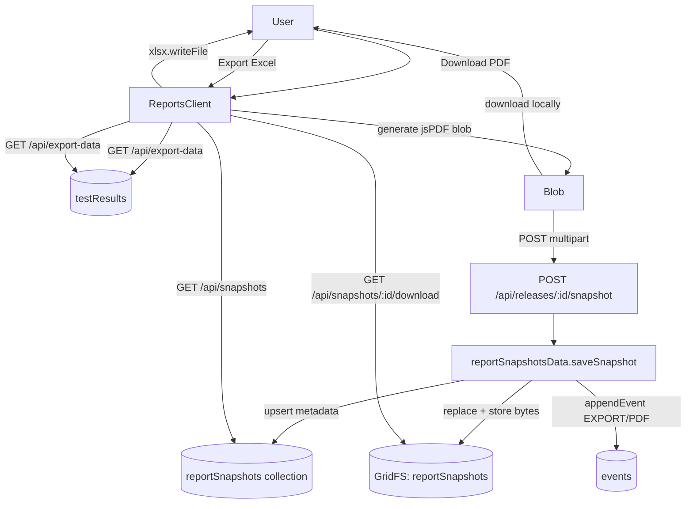

# Reports Page — PDF Snapshots, Version History & Excel Export

**Date:** 2026-06-01
**Jira:** RXR-11849
**Status:** Draft for review

## 1. Problem & Goals

The current `/reports` page (rebuilt on the releases+environments model) shows an
Overview + Application Breakdown + ad-hoc Excel/PDF export, but it lost the
version-history concept and never persisted anything. The product intent is
narrower and clearer:

- **PDF = a stored, point-in-time report snapshot** for a Release + Environment.
- **Excel = an editable, import-compatible export** of the latest data — never stored.
- **Version History = the list of currently stored PDF snapshots**, one per Release + Environment.

The UI must be **intuitive and self-guiding** for a first-time user: every action
explains what it does and what it will (and won't) change, via MUI `<Alert>`,
`<Tooltip>`, and `helperText` — no external documentation required.

### Non-goals (YAGNI)

- No chronological archive of past snapshots (only the latest per combo is kept).
- No snapshot deletion UI in this iteration (replacement is the only mutation).
- No server-side PDF rendering — PDFs are generated client-side and uploaded.
- No Excel snapshotting, auditing, or history.
- No backward-compatibility shims for the removed `versions`/`testRuns` model.

## 2. Behavior Specification (source of truth)

### PDF

- User can download a PDF for any Release + Environment.
- Downloading **generates a fresh report** and **immediately downloads it** to the user.
- The same generated bytes become the **stored snapshot** for that Release + Environment.
- **Exactly one snapshot is retained per (Release, Environment).** Re-downloading for the
  same combo **replaces** the prior snapshot (old GridFS bytes are deleted).
- The stored snapshot can be **re-downloaded later from Version History without regeneration** —
  the exact original bytes are returned.
- Generating a snapshot writes an **audit event** (`category: EXPORT`, `action: PDF`).

### Version History

- Displays **one entry per (Release, Environment)** that has a stored snapshot, across all releases.
- It is **not** chronological history — it lists the currently stored snapshots only.
- Columns: **Release · Environment · Snapshot Timestamp · Generated By**, plus a Download action.

### Excel

- User can export Excel for any Release + Environment.
- Always built from the **latest saved data** for the selection.
- Output is **import-compatible** with the associated Release (round-trips through `utils/excelImport.js`).
- Export **does not** create a snapshot, audit entry, or Version History entry.

## 2.1 Implementation Principles (clean-slate)

This is a clean-slate rebuild, not an incremental patch on the existing page. The implementation
plan and the resulting code must follow these:

- **Rewrite, don't diff.** `ReportsClient.jsx` is authored fresh from the design below — not the
  current file with lines added/removed. The result should read as if written from scratch, with a
  coherent top-to-bottom structure (context → overview → actions → history), not as accreted patches.
- **No legacy, no back-compat.** Nothing is preserved "just in case." Anything the new design
  doesn't use is deleted in the same change (see §3.1) — dead imports, props, state, helpers, files.
- **Idiomatic over clever.** Follow the patterns already established in the codebase: `(db, teamId, …)`
  DB-layer signatures returning `toClientDoc`, `withTeam`/`withAdmin` route wrappers, `lib/api/*`
  client helpers that mirror route shapes, MUI v9 components from `@/components`, enums from
  `@/lib/constants`. Match the surrounding code's naming, comment density, and idiom.
- **Single purpose per unit.** Each new file does one thing: `reportSnapshotsData.js` owns storage,
  each route owns one HTTP concern, `lib/api/snapshots.js` owns client transport, `ReportsClient`
  owns presentation + flow orchestration only. No DB queries in routes/pages, no transport in components.
- **No silent failure paths.** Every branch is handled and observable (toast / Alert / HTTP error);
  no happy-path-only logic (see §6).

## 3. Architecture



### Data model

**GridFS bucket:** `reportSnapshots` (`reportSnapshots.files` / `reportSnapshots.chunks`).
Stores the raw PDF bytes. The GridFS file `metadata` carries `{ teamId, releaseId, environment }`
so orphan cleanup and team scoping are enforceable.

**Metadata collection:** `reportSnapshots`

| Field | Type | Notes |
|---|---|---|
| `_id` | ObjectId | |
| `teamId` | string | mandatory scope on every query |
| `releaseId` | string | |
| `releaseName` | string | denormalized for display (release may later be renamed; snapshot keeps the name at generation time) |
| `environment` | string | |
| `fileId` | ObjectId | GridFS file id |
| `filename` | string | e.g. `regression-signoff-2.5-QA-2026-06-01.pdf` |
| `byteSize` | number | |
| `generatedBy` | string | `session.user.name` (fallback email) |
| `generatedAt` | Date | |

**Unique index:** `{ teamId: 1, releaseId: 1, environment: 1 }` — enforces one snapshot per combo.
Replacement = delete old GridFS file by `fileId`, then upsert metadata + new `fileId`.

### New / changed files

| File | Change |
|---|---|
| `lib/db/reportSnapshotsData.js` | **new** — `saveSnapshot`, `listSnapshots`, `getSnapshotFile` |
| `app/api/releases/[id]/snapshot/route.js` | **new** — `POST` multipart (PDF blob + environment) |
| `app/api/snapshots/route.js` | **new** — `GET` list snapshots for team (Version History) |
| `app/api/snapshots/[id]/download/route.js` | **new** — `GET` stream PDF from GridFS |
| `lib/api/snapshots.js` | **new** — client helpers: `saveSnapshot(releaseId, formData)`, `listSnapshots()`, `snapshotDownloadUrl(id)` |
| `app/(app)/reports/page.js` | rewritten: fetch + pass `initialSnapshots` from `listSnapshots(db, teamId)`; no `listApplications` |
| `app/(app)/reports/ReportsClient.jsx` | **rewritten from scratch** to the §5 structure (context → overview → PDF → Excel → history); not a diff of the current file (see §2.1, §3.1) |
| `app/(app)/reports/loading.js` | rewritten skeleton matching the new layout exactly (per `loading.js` parity rule) |
| `lib/constants.js` | reuse `AUDIT_CATEGORY.EXPORT` / `AUDIT_ACTION.PDF` (already present — no change) |

### 3.1 Clean-slate removals (no legacy, clean as you go)

This is a clean-slate rebuild — delete every construct made redundant by the new design in the
same change; leave no dead imports, props, state, or files behind.

| Remove | Reason |
|---|---|
| `appBreakdown` state + Application Breakdown table (`ReportsClient`) | Out of scope for the spec's three actions; "keep it simple and focused." |
| Client-side `caseId → applicationId` join (`listTestCasesForRelease` + `caseAppMap`/`appGroups`/`appNameMap`) | The join silently dropped rows and could disagree with Overview totals (flagged risk). Removed entirely. |
| `applications` prop + `listApplications` import (`page.js`, `ReportsClient`) | Only fed the breakdown name map and the scope select — both removed. |
| "Application / Scope" select in the Export panel | Spec scopes exports to Release + Environment only; no per-application filtering. |
| `lib/db/reportsData.js` (if any stale copy resurfaces) | Already deleted on `dev`; ensure no re-import. |
| Unused icon imports left after the rework | Clean-as-you-go: prune on touch. |

After removal, `ReportsClient` keeps only: `useReleaseEnv`, `listResults` (Overview + export source),
`apiExportData` (Excel/PDF data), `generateSignoffReport`, the new `lib/api/snapshots.js` helpers,
and the shared UI components. `computeSummary` stays (drives the compact Overview).

### `lib/db/reportSnapshotsData.js` interface

```js
// Store/replace the single snapshot for (release, env). Returns client metadata doc.
saveSnapshot(db, teamId, { releaseId, releaseName, environment, generatedBy, buffer, filename })

// All snapshots for the team, newest first. Returns client metadata docs.
listSnapshots(db, teamId)

// Resolve a snapshot for download. Returns { stream, filename, byteSize, contentType }.
getSnapshotFile(db, teamId, snapshotId)
```

All functions take `(db, teamId, …)`, validate `teamId`, scope every query by `teamId`,
and return metadata via `toClientDoc`. `saveSnapshot` runs inside a transaction:
1. find existing metadata for `(teamId, releaseId, environment)`;
2. if present, delete its GridFS file;
3. open GridFS upload stream, write `buffer`, capture new `fileId`;
4. upsert metadata;
5. `appendEvent(db, teamId, { category: EXPORT, action: PDF, releaseId, environment, by: generatedBy, at })`.

> Note: GridFS streams are not transactional with the metadata write. The transaction
> wraps the metadata upsert + event; the GridFS write happens first and is referenced by
> `fileId`. If the metadata upsert fails, the freshly written GridFS file is deleted in a
> `catch` to avoid orphans.

## 4. Client PDF flow (ReportsClient)

`onDownloadPdf()`:
1. Guard: require `releaseId` + `environment`; otherwise the button is disabled (see UX).
2. `const cases = await apiExportData({ releaseId, environment })`.
3. If `cases.length === 0` → `showToast('No test cases to export', 'info')`, abort.
4. `const doc = await generateSignoffReport({ cases, appName: 'All Applications', environment, version: releaseName })`.
5. `const blob = doc.output('blob')`.
6. **Immediately download** locally: `doc.save(filename)` (or anchor click on the blob).
7. **Upload** the same `blob` via `FormData` → `POST /api/releases/:id/snapshot` (`environment`, `filename`, `file`).
8. On success: `showToast('PDF downloaded and saved to Version History', 'success')`, refresh the
   Version History list (re-`listSnapshots()` or optimistic upsert).
9. On upload failure: the local download already happened — `showToast('PDF downloaded, but saving to Version History failed', 'warning')`.

Excel flow is unchanged from the current `exportExcel()` (client `xlsx`), minus any snapshot/audit.

## 5. UI / UX Design (self-guiding)

**Aesthetic direction:** refined, calm, utilitarian — this is an internal QA tool, so clarity
beats flourish. Restraint executed precisely (per frontend-design): generous spacing, a single
accent for primary actions, no decorative noise. Distinctiveness comes from the *guidance*, not ornamentation.

**Layout (top → bottom):**

1. **PageHeader** — title `Reports`, sub: "Generate signed-off PDF snapshots and editable Excel exports for a release and environment."

2. **Context bar** — chips showing the active **Release** + **Environment** (from `useReleaseEnv`).
   - If none selected: `<Alert severity="info">` — "Select a release and environment from the top bar to generate reports." All action buttons disabled.

3. **Panel "Overview" (read-only context)**
   - Compact metric cards: Total · Pass · Fail · Pending, plus a `<PassRateBar>`.
   - Source: `computeSummary(listResults(releaseId, { environment }))`. No breakdown, no join.

4. **Panel "Download PDF" (primary)**
   - `<Alert severity="info">`: "Downloading a PDF generates a fresh report, downloads it to you, and saves it as the snapshot for this release + environment. Generating again replaces the previous snapshot."
   - Primary `<Button>` **Download PDF** wrapped in `<Tooltip title="Generates and downloads a PDF, and stores it in Version History (one snapshot per release + environment).">`.
   - Loading state on the button while generating/uploading.

5. **Panel "Export Excel"**
   - `<Alert severity="info">`: "Excel exports reflect the latest saved data and can be re-imported into this release. They are not saved to Version History or audited."
   - `<Button variant="outlined">` **Export Excel** + `<Tooltip>` echoing the same, with `helperText`-style caption under it: "Editable · import-compatible · not stored."

6. **Panel "Version History"**
   - `<Alert severity="info">` (dense): "Shows the latest stored PDF snapshot for each release + environment. Only the most recent snapshot per combination is kept."
   - Table — columns **Release · Environment · Snapshot Timestamp · Generated By · (Download)**.
     - Timestamp via `dateStamp`; Download = anchor to `snapshotDownloadUrl(id)` with a `<Tooltip title="Download the stored snapshot (no regeneration).">`.
   - `<EmptyState>` when no snapshots: icon + "No snapshots yet" + "Download a PDF to create your first snapshot."

**Resolved (clean-slate):** keep a **compact read-only Overview** card (total / pass / fail /
pending + pass-rate bar, from `computeSummary(listResults(...))`) so the user sees *what* they're
about to export. The **Application Breakdown** table and its client-side join are **removed** (see
§3.1). This is the only data shown beyond the three primary actions.

**Compliance:** layout uses `Stack`/`Grid` (no `Box` layout wrappers), MUI v9 APIs (`slotProps`,
`Grid size`), constants from `@/lib/constants`, icons verified against `@mui/icons-material`,
empty state composed per project rules. Will run web-design-guidelines review on the final JSX.

## 6. Error Handling

| Case | Handling |
|---|---|
| No release/environment selected | Buttons disabled; info Alert guides selection |
| No test cases for selection | Toast "No test cases to export"; no snapshot written |
| PDF generated but upload fails | Local download already done; warning toast; history not updated |
| GridFS write succeeds, metadata upsert fails | `catch` deletes the orphan GridFS file; 500 to client |
| Download of missing snapshot | 404 `{ error: 'Snapshot not found' }` |
| Unauthorized | Handled by `proxy.js` (401) — route does not re-check session existence |
| `teamId` falsy | `reportSnapshotsData` throws `ApiError(400, 'teamId required')` |

## 7. Testing

Per project rules (observable behavior; mock DB/GridFS/network; ask before adding cases).

- `lib/db/reportSnapshotsData.js`: save→replace deletes prior GridFS file; one-per-combo enforced;
  `listSnapshots` scoped by teamId; `getSnapshotFile` 404 on missing/cross-team; event appended on save.
- `POST /api/releases/[id]/snapshot`: valid multipart → 200 + metadata; missing env → 400;
  mock `next/cache` per project rule if revalidate is used.
- `GET /api/snapshots`: returns team-scoped list.
- `GET /api/snapshots/[id]/download`: streams bytes + correct `Content-Type`/`Content-Disposition`; 404 missing.
- Client: PDF flow downloads even when upload fails (warning path); Excel flow writes no snapshot.

## 8. Documentation & Smoke Test

- Update `.claude/skills/smoke-test/SKILL.md` (routes + mutations changed: new snapshot/download endpoints, PDF now mutates).
- Update `README.md` feature list before implementation (spec-first).
